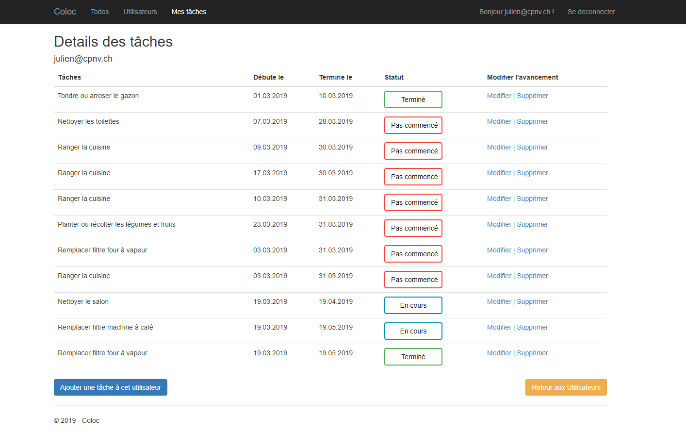

# Coloc
> Coloc is an ASP.net school project managing tasks in a flatsharing.


## Requirements
- Microsoft Sql Server 
- Microsoft Sql Server Management Studio
- Visual Studio 2017 
- Net Core 2.1

## Installation
### Database
Execute [this script](docs/database/CreateDbWithSeeder.sql) in Microsoft SQL Server Management Studio to create an operationnal DB.

<aside class="warning">
You need to set an existing path about the files Coloc.mdf and Coloc_log.ldf (exemple below). Make sure you have write access to those folder too.
</aside>

> Be sure your FILENAME path exists.
```sql
 ON  PRIMARY 
( NAME = N'Coloc', FILENAME = N'C:\Program Files (x86)\Microsoft SQL Server\MSSQL13.MSSQLSERVER\MSSQL\DATA\Coloc.mdf' , SIZE = 8192KB , MAXSIZE = UNLIMITED, FILEGROWTH = 65536KB )
 LOG ON 
( NAME = N'Coloc_log', FILENAME = N'C:\Program Files (x86)\Microsoft SQL Server\MSSQL13.MSSQLSERVER\MSSQL\DATA\Coloc_log.ldf' , SIZE = 8192KB , MAXSIZE = 2048GB , FILEGROWTH = 65536KB )
GO
```
There is also [this script](docs/database/CreateEmptyColocDB.sql) to create DB without data.

### Project
Clone the current project and open the Coloc.sln file:
- `git clone https://github.com/CPNV-ES/Coloc.git`

### Setup
Once in the project, don't forget to scaffold the models with this command (use the -Force flag if scaffold a second time) :
- `Scaffold-DbContext "Server=localhost;Database=Coloc;Trusted_Connection=True;" Microsoft.EntityFrameworkCore.SqlServer -OutputDir Models`

## Utilisation
There is a login system in the application. Here are the credentials and informations on each user :  

| Identifiant  | Mot de passe   | Rôle  |
|---|---|---|
|  julien@cpnv.ch |  Pa$$w0rd | Admin  |
|  benjamin@cpnv.ch | Pa$$w0rd | User |
| kevin@cpnv.ch   | Pa$$w0rd | User |
| steven@cpnv.ch   | Pa$$w0rd | User |
| davide@cpnv.ch   | Pa$$w0rd | User |
| antonio@cpnv.ch   | Pa$$w0rd | User |
| bastien@cpnv.ch   | Pa$$w0rd | User |

An administrator has modifications rights (add tasks, todo, can assign a task to an user, can visualize all user's tasks, etc.), when an user will only see his own tasks.
